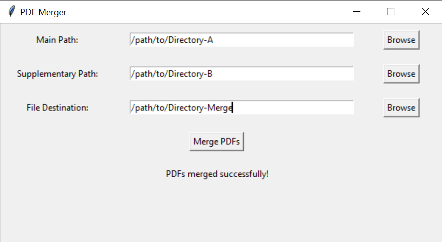

# A collection of PDF Utility Software I made for my father.

## 2-PDF-Merger :
    Merge corresponding PDFs from two different directories with files having different names but same numbers.
    Example Usage: Let's say you have two directories, "Directory_A" and "Directory_B," each containing multiple PDF files. These files have different names but the same numbers. For example:

| Directory_A      | Directory_B           |
|------------------|------------------------|
| file_001.pdf     | document_001.pdf      |
| file_002.pdf     | document_002.pdf      |
| file_003.pdf     | document_003.pdf      |
| ...              | ...                   |
| file_999.pdf     | document_999.pdf      |

You want to merge PDF files with the same numbers from both directories. Here's how you can use your "2-PDF-Merger" software:

